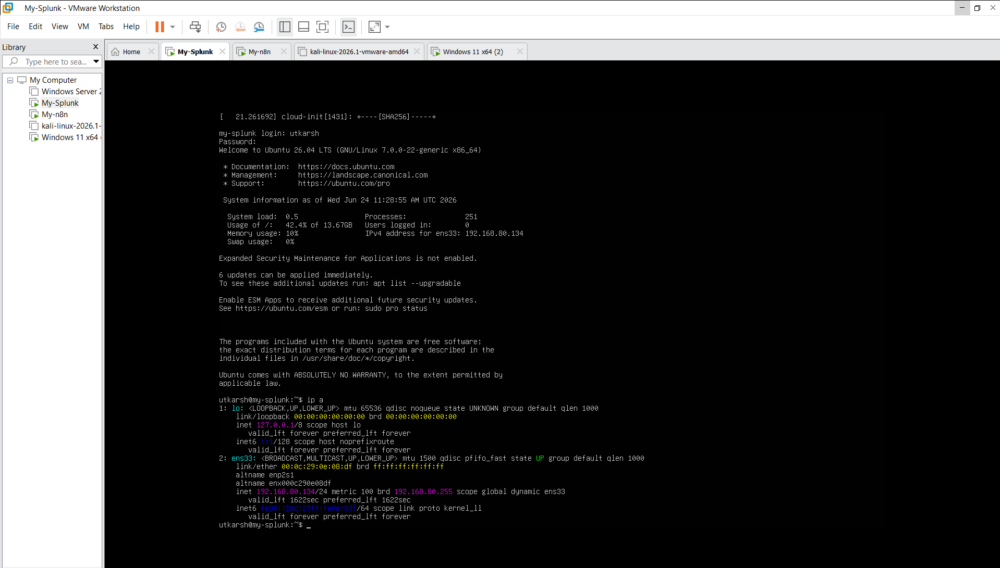
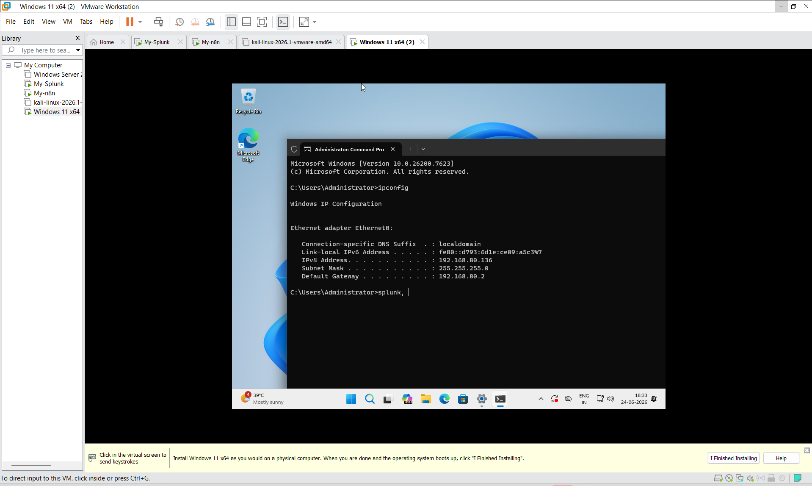
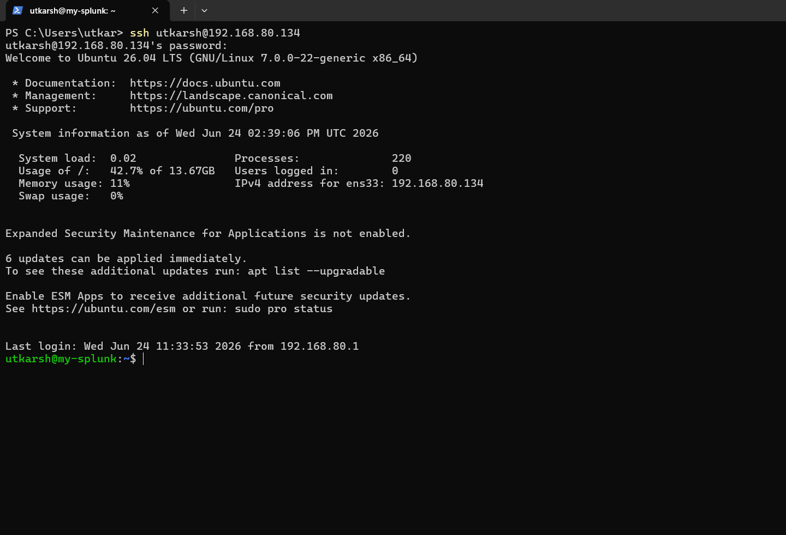
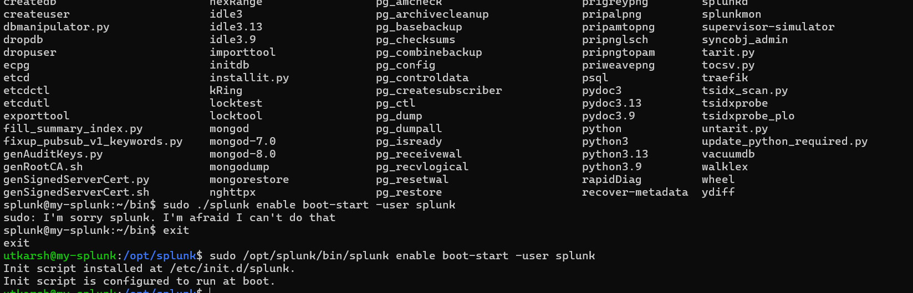

# 🛡️ Automated Incident Response & Threat Detection Lab

An enterprise-grade simulation of a modern Security Operations Center (SOC) engineering project using an independent target endpoint, centralized SIEM logging, and an advanced automated playbook engine.

---

## 🏗️ Phase 1: Virtual Infrastructure & Base Environment Deployment

The foundation of this automated SOC lab consists of a hybrid virtual environment designed to host the attack platform, target endpoint, SIEM analytics engine, and the automation framework. To ensure system stability on a 16 GB host machine, memory allocations were strictly optimized to prevent resource contention.

### 💻 Infrastructure Architecture & Resource Matrix

| Component | Operating System | Deployment Model | Allocated RAM | Purpose |
| :--- | :--- | :--- | :--- | :--- |
| **Windows 11 Target** | Windows 11 Enterprise | VMware Workstation | 4.0 GB | Victim Endpoint / Telemetry Log Source |
| **Splunk Enterprise** | Ubuntu Server 24.04 LTS | Native Instance | 4.0 GB | Centralized SIEM / Log Ingestion Engine |
| **n8n Automation** | Ubuntu Server 24.04 LTS | Node.js / Docker | 1.5 GB | Advanced SOAR / Incident Orchestrator |
| **Attack Box** | Kali Linux | VMware Workstation | 2.0 GB | Adversary Emulation / Attack Generation |

---

### 🔍 Base Environment Verification & Proof of Deployment

To validate successful deployment and underlying network availability across the environment, the following baseline configurations have been verified and logged:

#### 1. Native Guest Console Configuration
* **Verification:** Successful initialization of the Ubuntu Server environment hosting the SIEM backbone. Network interface mapping confirmed via local shell execution.


#### 2. Local Administration & Endpoint Baseline
* **Verification:** Deployment of the Windows 11 target environment. Bypassed default SaaS provisioning restrictions to implement a clean local administrator node for telemetry collection.


#### 3. Remote Host Management (SSH Connection)
* **Verification:** Active Secure Shell (SSH) connection established from the host system terminal directly into the Linux backend environment (`utkarsh@192.168.80.134`). This confirms full cross-platform access and network routing between the host machine and the virtual hypervisor tier.


---

## 🏗️ Phase 2: Splunk Enterprise Core Configuration & Log Ingestion Pipeline

Day 2 shifted focus toward establishing the centralized SIEM logging backbone, dynamically managing host storage infrastructure to bypass enterprise-grade security blocks, and mapping an active ingestion pipeline from the target endpoint.

### 🔍 Advanced Storage Management & CLI Configurations

During deployment, the Splunk indexing daemon halted search processes due to an automated safety threshold block requiring a minimum of 5GB of free space on the primary storage tier. To maintain infrastructure health on the local machine, a dynamic filesystem upgrade was executed live:

1. **Virtual Hardware Scaling:** Modified hypervisor settings to expand the provisioned storage allocation from **30 GB to 60 GB**.
2. **LVM Configuration:** Rescanned the physical block layer and extended the logical container natively:
   ```bash
   sudo pvresize /dev/sda
   sudo lvextend -l +100%FREE /dev/ubuntu-vg/ubuntu-lv

   ### ⚙️ Splunk Enterprise Base Configuration
Successfully configured the newly installed Splunk Enterprise instance on the Ubuntu Server (`my-splunk`) to automatically enable boot-start execution under the local `splunk` user account.



---

## 🚀 Phase 3: n8n Automation Engine Deployment via Docker

Day 3 shifted focus toward deploying the orchestration and automation layer of the SOC infrastructure. The n8n automation engine was containerized to handle incident response playbooks and interact seamlessly with the existing SIEM telemetry.

### 💻 Containerization & System Preparation

To establish an isolated orchestration environment, the underlying container runtime was installed and workspace directories were structured:

1. **Docker Engine Installation:** Deployed the core Docker package (`docker.io`) to manage container lifecycles natively on the Ubuntu host.
2. **Workspace Initialization:** Created a dedicated operational directory to house configuration files and persistent data volumes:
   ```bash
   mkdir n8n-compose
   cd n8n-compose

 # 🚀 Orchestration Execution & Storage Configuration

Following the container configuration, the orchestration engine was successfully initialized. Critical storage permission structures were audited and modified to ensure the containerized environment could properly write persistent data to the host system.

## 🔧 Troubleshooting & Syntax Adaptation

Encountered a `command not found` error when attempting to use the legacy `docker-compose` binary. The issue was resolved by adapting to the modern Docker V2 plugin architecture, successfully pulling the required n8n image layers using the updated syntax.

```bash
sudo docker compose pull
```

## ▶️ Service Initialization

Successfully executed the Docker Compose manifest to create the internal Docker network and start the n8n container in detached mode.

```bash
sudo docker compose up -d
```

<p align="center">
  
</p>

*Figure 1: Successful initialization of the n8n container using Docker Compose.*

## 🌐 Network & Firewall Verification

Verified the host firewall configuration to ensure no local networking restrictions would interfere with container access. The Uncomplicated Firewall (UFW) was confirmed to be inactive, allowing unrestricted access to the exposed **port 5678**.

```bash
sudo ufw status
```

## 💾 Persistent Storage Permissions Fix

Identified a permissions issue where the mapped `n8n_data/` volume was automatically created with **root ownership**, preventing the containerized **n8n** process from writing workflow data and the SQLite database.

Resolved the issue by recursively assigning ownership of the directory to the standard container user (**UID:1000, GID:1000**).

```bash
sudo chown -R 1000:1000 n8n_data/
```

## 🌍 First Access to the n8n Web Interface

After completing the configuration, the n8n web interface was successfully accessed through the browser using the exposed **port 5678**, confirming that the orchestration service was running correctly.

<p align="center">
  
</p>

*Figure 2: Successful first-time access to the n8n web interface.*

## ✅ Outcome

* Successfully initialized the n8n orchestration environment.
* Resolved Docker Compose version compatibility issues.
* Verified host firewall settings for local accessibility.
* Corrected persistent storage permissions for container write access.
* Successfully accessed the n8n web interface.
* Ensured reliable persistence of workflows and the SQLite database across container restarts.
